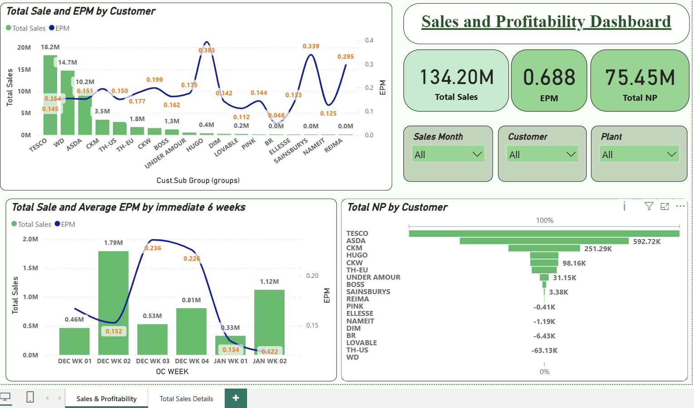

# 👕 Apparel Sales & Profitability Dashboard

An end-to-end **Power BI** dashboard built for an apparel manufacturing & export business, tracking sales orders from booking through shipment, alongside product costing and profitability (NP, GP, EPM) at order-line level.

> Built on **SAP sales order (SO) extract** data — exported from SAP, cleaned and structured in Excel, then loaded into Power BI — combined with a **cost-sheet / EPM (Earnings Per Minute) summary table**, giving both a commercial (sales) and operational (costing/efficiency) view of the apparel value chain.

---

## 📊 Dashboard Snapshot

| Metric | Value |
|---|---|
| Order lines analyzed | **6,256** |
| Total FOB Sales Value | **$134.2M** |
| Total Net Profit (NP) | **$204.7K** |
| Total Gross Profit (GP) | **$277.1K** |
| Distinct customers (Sold-to) | **41** |
| Distinct brands | **26** |
| Business units (SBU) | **3** (Kinetix, Intimates, Kids) |
| Destination countries | **26** |
| Data period | **Aug 2024 – Jan 2026** |


---

## 🗂️ Data Model

The model uses a **star-ish, cost-focused schema** with 2 core fact/detail tables and 14 hidden auto-generated date tables (Power BI's built-in date hierarchies for time intelligence).

### 1. `Filtered` — Sales Order Fact Table
The primary transactional table (~150 columns), one row per **Sales Order Line Item**, sourced from a SAP extract cleaned and staged in Excel (`Sales Dashboard 11.xlsx`). Key column groups:

| Group | Example Columns |
|---|---|
| **Order identifiers** | CPO Number, Sales Order, SO LI, Sales Doc. Type, Ref. Order/Item |
| **Customer & channel** | Sold to Party, Ship to Party, Dist. Channel, Customer Group, Cust. Sub Group |
| **Product / merchandising** | Brand, Gender, SBU, Pillar, Product Group/Category, Silhouette, Season, Season Year, Construction, Fabrication, Print/Embroidery/Heat Seal/Handwork |
| **Plant & logistics** | Plant, Country of Origin/Destination, Incoterm, Shipping Point, Ship Mode |
| **Dates (10 relationships)** | Req. Delivery Date, RM In Date, Planned Cut Date, Original/Revised Ex-Factory Date, Sales Month, OC Month, SO Created On, Planned End Date, Document Date, Original/Revised AC Date |
| **Quantities** | Order Qty, QTY (PCS), Delivery Qty, Variance Qty, Pack Qty |
| **Costing** | Fabric Cost, Accessory Cost, Packing Trim Cost, Services Cost, RMC, Factory Cost, Corporate Cost, Finance Charge |
| **Profitability** | FOB, Total FOB, NP, GP, NP/FOB, Earnings per PC, Total Earnings, CM/UM, EPM |
| **Efficiency / production** | Sewing SMV, Packing SMV, Total SMV, Efficiency, ACT EFF, CPCM |
| **Status tracking** | Overall Status, Cost Sheet Status, Plan Status, SHIP% |

### 2. `EPM Table` — Monthly EPM Summary
A pre-aggregated table (by Customer Sub-Group / Sales Month / OC Week) used to drive the **Earnings Per Minute** trend measures independently of the line-level fact table, avoiding double-counting when summarizing at month level.

### Relationships
- 13 one-to-many relationships from `Filtered`'s date columns → 13 hidden local date tables (enables independent Year/Quarter/Month/Day slicing on Req. Delivery Date, Ex-Factory Date, Sales Month, Document Date, etc.)
- `Filtered[Cust.Sub Group]` ↔ `EPM Table[Cust.Sub Group]` (bi-directional, many-to-many) linking sales detail to the EPM summary.

---

## 🧮 Key Measures (DAX)

| Measure | DAX | Purpose |
|---|---|---|
| **Total Sales** | `COALESCE(SUM('EPM Table'[Sum of Total FOB]), 0)` | Total booked FOB sales value, null-safe for card/trend visuals |
| **Total NP** | `COALESCE(SUM('EPM Table'[Sum of Total NP]), 0)` | Total Net Profit, null-safe |
| **EPM** | `DIVIDE(SUM('EPM Table'[Sum of Total Earnings]), SUM('EPM Table'[Sum of Total SEWING SMV]))` | Earnings Per Minute — a core apparel-manufacturing KPI: $ earned per standard minute of sewing labor, used to gauge production-line profitability |

Beyond these explicit measures, the report also uses implicit aggregations on `Filtered` (SUM of FOB, NP, GP, Order Qty, AVERAGE of Efficiency, NP/FOB, SHIP%) directly in visuals — common practice for fast, ad-hoc analysis on a wide fact table.


---

## 💡 Business Insights (from current data)

- **Business-unit concentration**: **Intimates** dominates FOB sales at **$90.7M**, dwarfing Kids (**$28.7M**) and Kinetix (**$14.7M**) — despite Kids carrying the highest unit volume (7.9M pcs), pointing to a much lower average selling price per unit in that segment.
- **Customer concentration risk**: A single customer, **Moose Clothing**, accounts for **~43%** of total FOB value ($57.5M of $134.2M) — a strong signal to track key-account dependency and diversify the customer base.
- **Geographic concentration**: **Sri Lanka, USA, and UK** together represent the vast majority of destination-country FOB (~$115M of $134M) — Sri Lanka appears both as a domestic/regional destination and manufacturing base.
- **Gender mix**: **Menswear** leads FOB value (**$76.8M**, ~57% of total) despite lower unit volume than kids/toddler lines — again suggesting higher unit prices in adult categories.
- **Program mix**: **Regular** replenishment programs ($66.1M) and **Fashion** programs ($33.6M) are the two largest volume/value drivers; Fashion programs generate disproportionately high unit volume (8.45M pcs) relative to FOB value, typical of lower-priced fast-fashion SKUs.
- **Margin visibility**: NP/FOB (net profit as % of FOB) and EPM are tracked at line level, enabling the business to spot loss-making or thin-margin styles, customers, or seasons before they scale up in volume.
- **On-time delivery**: SHIP% is tracked per order line, enabling delivery-performance analysis by customer, plant, or ship mode.

---

## 🗂️ Main Data Fields

The dashboard draws on the following field groups from the SAP-sourced, Excel-cleaned dataset:

### Order & Document Information
- CPO Number, Sales Order, SO LI, Sales Doc. Type, Ref. Order / Ref. Item, Document Date

### Customer & Channel
- Sold to Party / Ship to Party, Customer Group, Cust. Sub Group, Distribution Channel

### Product & Merchandising
- Brand, Gender, SBU, Pillar, Product Group / Category, Silhouette, Season, Season Year, Construction, Fabrication

### Plant & Logistics
- Plant, Country of Origin / Destination, Incoterm, Shipping Point, Ship Mode

### Dates
- Req. Delivery Date, RM In Date, Planned Cut Date, Original/Revised Ex-Factory Date, Sales Month, SO Created On, Planned End Date

### Quantities
- Order Qty, QTY (PCS), Delivery Qty, Variance Qty, Pack Qty

### Costing
- Fabric Cost, Accessory Cost, Packing Trim Cost, Services Cost, RMC, Factory Cost, Corporate Cost, Finance Charge

### Profitability
- FOB, Total FOB, NP, GP, NP/FOB, Earnings per PC, Total Earnings, EPM

### Efficiency / Production
- Sewing SMV, Packing SMV, Total SMV, Efficiency, ACT EFF, CPCM

### Status Tracking
- Overall Status, Cost Sheet Status, Plan Status, SHIP%

---

## 🔄 Data Analysis Workflow

The project follows a standard end-to-end BI workflow, starting from the ERP system:

```text
SAP (Sales Order Extract)
            ↓
     Excel Data Cleaning
   (standardizing fields, removing duplicates/errors)
            ↓
   Power Query (Data Transformation)
            ↓
        Data Modeling
   (relationships, hidden date tables)
            ↓
        DAX Measures
            ↓
  Interactive Visualizations
            ↓
      Business Analysis
```

Raw sales order data is pulled from **SAP**, cleaned and structured in **Excel** (correcting data types, handling blanks, standardizing descriptions), then imported into Power BI via **Power Query**, modeled, and surfaced through DAX-driven visuals.

---

## 🎛️ Interactive Features

The dashboard supports interactive, self-service analysis through:

- Slicers for Brand, SBU, Gender, Season, Customer Group, and Program Type
- Date-hierarchy filtering (Year → Quarter → Month → Day) on multiple date fields (Req. Delivery, Ex-Factory, Sales Month, Document Date)
- Cross-filtering between visuals (e.g., selecting a brand filters sales, profitability, and efficiency visuals together)
- KPI cards for Total Sales, Total NP, Total GP, and EPM
- Drill-through from summary visuals to order-line-level detail
- Tooltips showing underlying costing and margin breakdowns on hover

Users can combine filters such as **Season + Customer Group + Brand** to investigate profitability for a specific segment of the business.

---

## 🏭 How This Is Used in the Apparel Industry

This dashboard reflects a real **apparel manufacturing & export (CMT/FOB) workflow** and is directly usable by:

1. **Merchandising & Sales teams** — track sales order pipeline (CPO → SO) by customer, brand, season, and channel; monitor which styles/customers drive revenue vs. margin.
2. **Costing & Finance teams** — break down FOB price into fabric, accessory, trim, services, RMC, freight, and finance-charge components to protect margins during costing negotiations.
3. **Industrial Engineering / Production Planning** — use Sewing/Packing SMV, Efficiency %, and EPM to evaluate line productivity and labor-cost efficiency per style, directly linking factory-floor performance to profitability.
4. **Supply Chain & Logistics** — monitor Ex-Factory dates (Original vs. Revised), Ship Mode, Incoterms, and SHIP% to manage on-time delivery and freight/distribution cost control.
5. **Sourcing & Buying (customer side)** — Country of Origin/Destination and Supply Chain Model fields support compliance and sourcing-diversification reporting (relevant to duty/tariff and trade-agreement planning).
6. **Leadership/S&OP reviews** — SBU-, brand-, and season-level roll-ups support monthly/quarterly business reviews and customer profitability discussions.

Because the model mirrors a standard **apparel SO → costing → production → shipment** data flow, it can be adapted with minimal changes for any cut-and-sew apparel exporter, garment CMT factory, or sourcing office reporting to global retail brands.

---

## 🛠️ Tools & Technologies

- **SAP** — source ERP system for raw sales order data
- **Microsoft Excel** — data cleaning and staging before load
- **Power BI Desktop** (Compatibility level 1606)
- **Power Query (M)** for data ingestion and transformation
- **DAX** for measures and time-intelligence (built-in date tables)
- **Data Modeling** — relationships, hidden date tables, star-ish schema
- **Business Intelligence / Data Visualization** best practices
- Data source: `Sales Dashboard 11.xlsx` (Excel workbook, imported — for production use, consider migrating to a direct SQL/SAP connection with scheduled refresh)

---

## 📷 Dashboard Preview

### Sales Overview




## 🎓 Project Context

This project was developed as a **Power BI dashboard** to demonstrate the practical application of data analytics and business intelligence techniques to real apparel manufacturing and export sales data.

Raw sales order data was extracted from **SAP**, cleaned and prepared in **Excel**, then modeled and visualized in Power BI — reflecting a genuine end-to-end reporting workflow used in the apparel export industry, from ERP extract to executive-ready dashboard. The project demonstrates the ability to turn transactional SAP data into an interactive analytical tool that supports sales, costing, production, and supply-chain decision-making.

---

## 👨‍💻 Author

## Saranga Rathnayaka
#### Business Analyst | Data Analyst
**BSc in Industrial Statistics and Mathematical Finance**
University of Colombo

---

